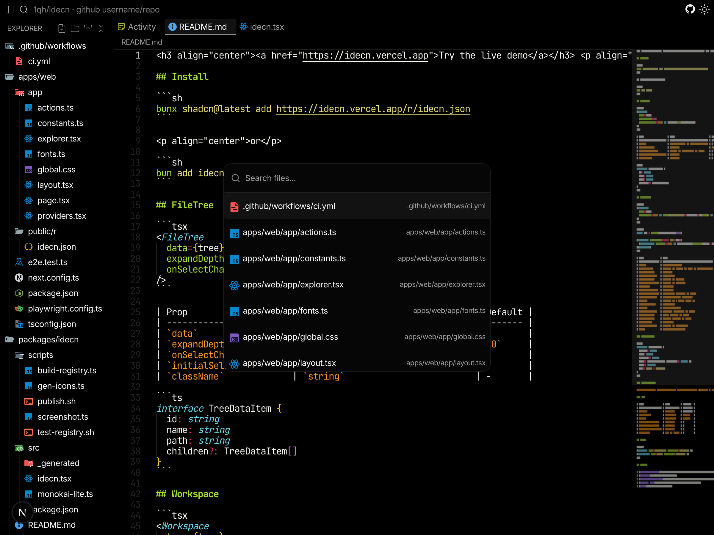

<h3 align="center"><a href="https://idecn.vercel.app">Try the live demo</a></h3> <p align="center"><a href="https://idecn.vercel.app"></a></p>

```sh
bunx shadcn@latest add https://idecn.vercel.app/r/idecn.json
```

<p align="center">or</p>

```sh
bun add idecn
```

## Workspace

IDE layout with file tree sidebar, tabbed editor, and async file loading.

```tsx
<Workspace
  tree={tree}
  onOpenFile={item => fetch(`/api/files/${item.path}`).then(r => r.text())}
/>
```

Custom sidebar:

```tsx
<Workspace onOpenFile={...} ref={ref}>
  <MyNavigation onSelect={item => ref.current?.openFile(item)} />
</Workspace>
```

### Workspace props

| Prop              | Type                                       | Default                     | Description                       |
| ----------------- | ------------------------------------------ | --------------------------- | --------------------------------- |
| `tree`            | `TreeDataItem[]`                           | -                           | File tree data (built-in sidebar) |
| `onOpenFile`      | `(item) => string \| null \| Promise<...>` | -                           | Fetch file content                |
| `sidebarSize`     | `string \| number`                         | `'250px'`                   | Sidebar default size              |
| `sidebarPosition` | `'left' \| 'right'`                        | `'left'`                    | Sidebar position                  |
| `sidebar`         | `boolean`                                  | -                           | Controlled sidebar visibility     |
| `defaultSidebar`  | `boolean`                                  | `true`                      | Initial sidebar visibility        |
| `onSidebarChange` | `(visible: boolean) => void`               | -                           | Sidebar toggle callback           |
| `editorOptions`   | `Record<string, unknown>`                  | -                           | Monaco editor options             |
| `theme`           | `string \| { dark, light }`                | monokai-lite / github-light | Monaco theme                      |
| `initialFiles`    | `string[]`                                 | -                           | File paths to open on mount       |
| `onFilesChange`   | `(files: string[]) => void`                | -                           | Called when open files change     |
| `renderLoading`   | `(item) => ReactNode`                      | -                           | Custom loading per file           |
| `ref`             | `Ref<WorkspaceRef>`                        | -                           | Imperative handle                 |

<details> <summary>Notes on sizing</summary>

`sidebarSize` uses [react-resizable-panels](https://github.com/bvaughn/react-resizable-panels) v4 sizing:

- `'250px'` - pixels (string)
- `'20%'` or `'20'` - percentage of container (string)
- `250` - pixels (number)

Numbers are **pixels**, not percentages. Use strings for percentages.

</details>

### WorkspaceRef

| Method            | Description               |
| ----------------- | ------------------------- |
| `openFile(item)`  | Open a file in the editor |
| `focusPanel(id)`  | Focus a panel by ID       |
| `toggleSidebar()` | Toggle sidebar visibility |

Keyboard: `Cmd+B` / `Ctrl+B` toggles sidebar.

### Tab

Extra tabs inside dockview.

| Prop                | Type         | Default  | Description           |
| ------------------- | ------------ | -------- | --------------------- |
| `title`             | `string`     | required | Tab title             |
| `closable`          | `boolean`    | `true`   | Show close button     |
| `icon`              | `boolean`    | `true`   | Show file icon        |
| `headerClassName`   | `string`     | -        | Always applied        |
| `activeClassName`   | `string`     | -        | Applied when active   |
| `inactiveClassName` | `string`     | -        | Applied when inactive |
| `onClose`           | `() => void` | -        | Called when closed    |

## FileTree

```tsx
<FileTree data={tree} onSelectChange={item => console.log(item?.path)} />
```

```ts
interface TreeDataItem {
  id: string
  name: string
  path: string
  children?: TreeDataItem[]
}
```

## Icons

```tsx
<FileIcon name="index.ts" className="size-4" />
<FolderIcon name="src" className="size-4" />
```

## Credit

- [shadcn-tree-view](https://github.com/MrLightful/shadcn-tree-view/tree/41624def)
- [dockview](https://dockview.dev)
- [material-icon-theme](https://github.com/material-extensions/vscode-material-icon-theme)
